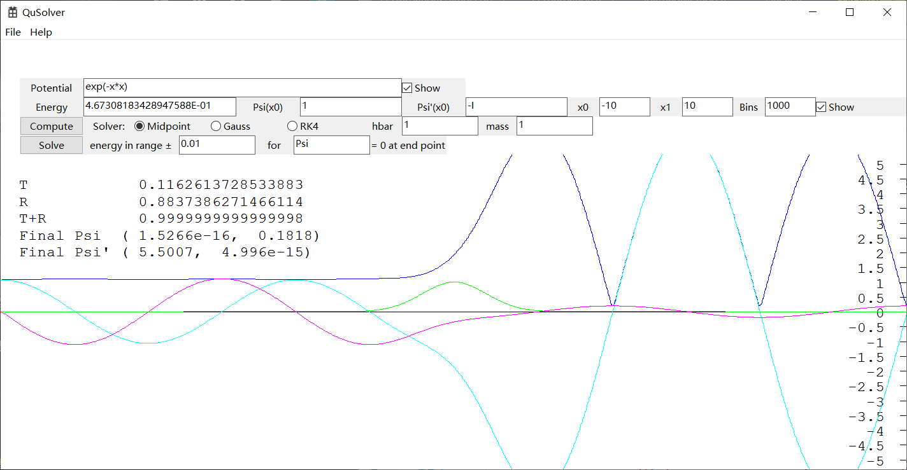

# QuSim
Quantum simulation and visualization program for wave function.

## Note
The core functions of this project is avoiding using the Windows SDK, except the GUI part.
Now the GUI part of this project is moving from native Windows API to the partable GUI library, ```nana```.
## Algorithm and Theory
 See the [FILE](theory/theory.pdf). Now the progress of document is far behind the codes.

## Quantum Evolution for 1 Dimension Wave Function
Solve the 1 D time evolution problem for given initial wave function and potential.


## Quantum Evolution for 2 Dimension Wave Function
Solve the 2 D time evolution problem for given inital wave function and potential.


## Solver for Quantum 1 Dimension Initial Value Problem
Solve the 1 D initial value problem for given intial condition, energy, and potential.
The solver for two-side boundary value problem using `shooting` method is also provoided. 


## Solver for Quantum 2 Dimension Scattering Problem
Solve the 2 D scattering problem for given initial wave function, energy, and potential.


